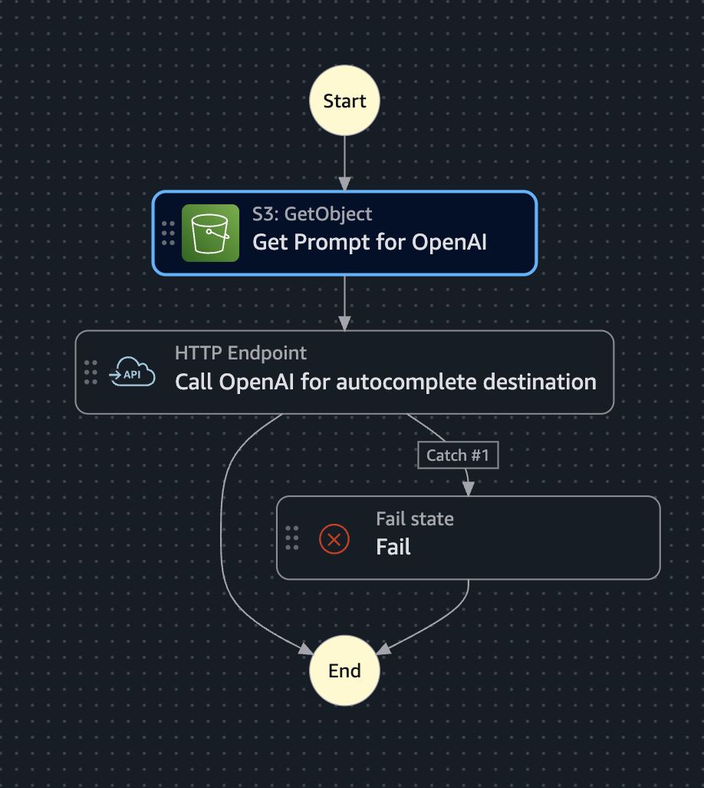
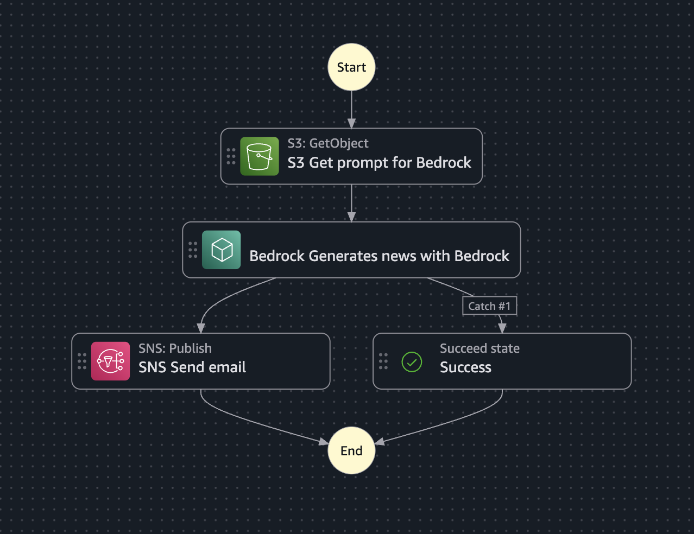
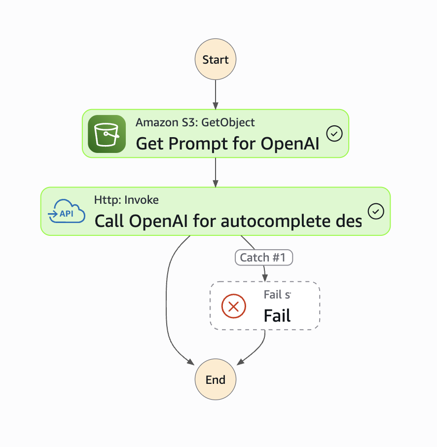
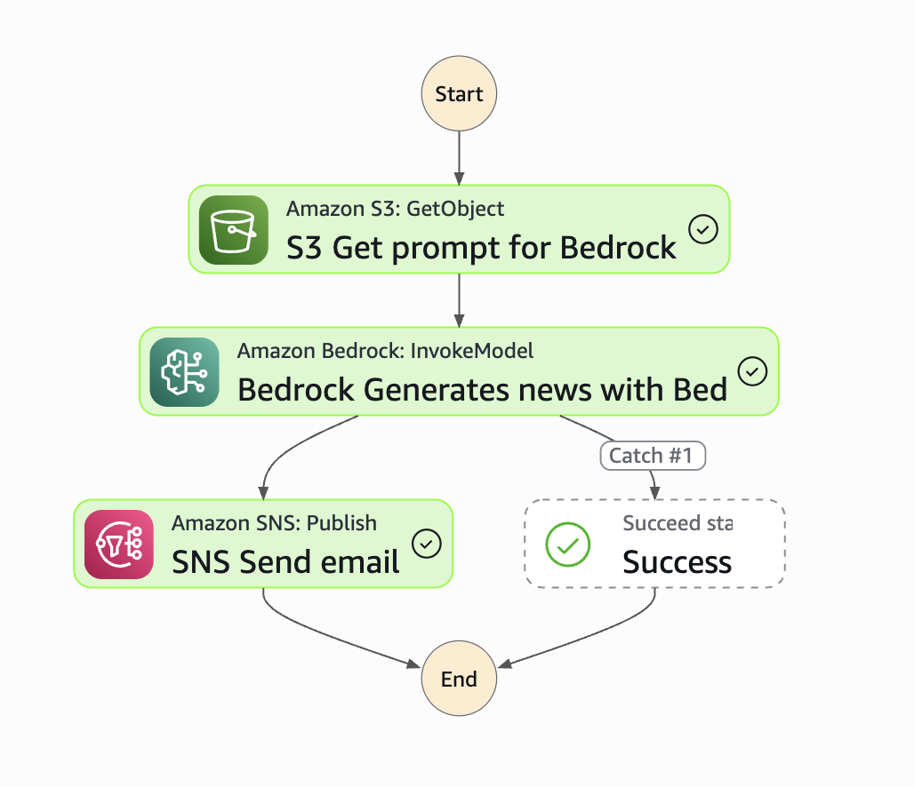

# Destination AI — Step Functions Demo

AWS CDK demo project isolating the Step Functions workflow from **Travel World**, a serverless travel booking platform. This repo contains only the `DestinationAiStack` — the AI-powered destination autocomplete and notification workflow — extracted for demonstration purposes.

## What problem does it solve?

Automates the destination creation process in an admin dashboard. Previously, creating a new destination required manually searching the internet for all the information (country, province, city, description, weather, activities, etc.), which took several minutes per product.

**Now**, by uploading an image (e.g., `Cordoba-Argentina.png`), all form fields are autocompleted in seconds using artificial intelligence. The admin only needs to review the suggestion in a modal and accept or reject it.

If the suggestion is accepted and the product is created, a second state machine is triggered — it generates a promotional email with Bedrock and sends it via SNS to all subscribers.

## Architecture


| Service | Role |
|---|---|
| **API Gateway (Destination AI)** | REST API that triggers the Step Functions for autocomplete and confirmation |
| **AWS Step Functions** | Orchestrates the AI autocomplete workflow with OpenAI and the notification workflow with Bedrock + SNS |
| **Amazon S3 (Prompts)** | Bucket `demo-statemachine-ai-destination-data-bucket` storing prompts for the AI workflows |
| **Amazon Bedrock** | Model `anthropic.claude-haiku-4-5-20251001-v1:0` for generating promotional email content |
| **Amazon SNS** | Sends emails to subscribed users notifying new destinations |
| **Amazon EventBridge** | Secure connection to the OpenAI API (stores credentials) |
| **Amazon CloudWatch Logs** | Execution logs for the EXPRESS state machine |
| **Amazon CloudWatch Dashboard** | Executions Started/Succeeded/Failed metrics for both state machines |

### Why Step Functions for orchestration?

The AI flow is a sequence of steps (read prompt → call OpenAI/Bedrock → notify) that needs retries and error handling between each call. Step Functions expresses that declaratively (`Retry`/`Catch` blocks in the ASL) using direct SDK integrations (`s3:getObject`, `bedrock:invokeModel`, `sns:publish`), so **no Lambda is needed just to glue these calls together** — less code to maintain, and each step is visible in the console for debugging.

- **Machine 1 (autocomplete) is EXPRESS** because the frontend needs a synchronous response in the same request (it opens the review modal with the AI suggestion, and must respond within 29s).
- **Machine 2 (confirm) is STANDARD and fire-and-forget** because the admin doesn't need to wait for the email to be generated and sent — the API responds 200 immediately after starting the execution.

## CDK Stacks

- `DestinationAiStack` — Step Functions + API Gateway AI + S3 prompts + SNS + EventBridge connection
- `CloudWatchStack` — Dashboard with Step Functions execution metrics for both state machines

## Local Setup

**Prerequisites:** Node.js 24+ (LTS), AWS CLI configured, AWS CDK installed globally.

```bash
# Install dependencies
npm install

# Compile TypeScript
npm run build

# Synthesize CloudFormation templates (no deploy)
npx cdk synth
```

## Deploy to AWS

### Manual deploy

```bash
npm run build && npx cdk deploy --all
```

### CI/CD with GitHub Actions

Every push to `main` triggers an automatic deploy via `.github/workflows/deploy.yml`.

The workflow:
1. Checks out the repo
2. Installs dependencies (`npm ci`)
3. Assumes an IAM role via OIDC (no long-lived credentials stored)
4. Runs `cdk deploy --all --require-approval never`

**Required GitHub secrets:** `DESTINATION_NOTIFICATION_EMAIL` and `AWS_ROLE_ARN` (the IAM role the workflow assumes via OIDC). Make sure the OIDC trust policy in AWS allows this GitHub repo.

## Testing without a frontend

This repo only contains the infrastructure — there's no frontend here. The full app (not included in this demo) triggers these workflows from an admin dashboard, with a human reviewing the AI suggestion before it's confirmed (see [Human-in-the-loop](#human-in-the-loop) below). To test the two state machines standalone, use the API Gateway endpoints directly with `curl`, Thunder Client, Postman, etc.

After `npx cdk deploy`, grab the URLs from the stack outputs (`DestinationAiApiUrl` and `ConfirmDestinationApiUrl`), or fetch them anytime with:

```bash
aws cloudformation describe-stacks \
  --stack-name DemoStepfunctionsDestinationAiStack \
  --query "Stacks[0].Outputs" \
  --region sa-east-1
```

**Machine 1 — Autocomplete (sync, responds with the AI suggestion):**

```bash
curl -X POST "<DestinationAiApiUrl>" \
  -H "Content-Type: application/json" \
  -d '{"destination": "Cordoba, Argentina"}'
```

**Machine 2 — Confirm (fire-and-forget, triggers the Bedrock + SNS email):**

```bash
curl -X POST "<ConfirmDestinationApiUrl>confirm" \
  -H "Content-Type: application/json" \
  -d '{"destination": "Cordoba, Argentina"}'
```

You can also trigger either state machine directly from the Step Functions console ("Start execution") with a test input of `{ "destination": "Cordoba, Argentina" }` — useful for inspecting the execution graph and debugging individual states.

> No authentication is configured on these endpoints (demo purposes only). Anyone with the URL can invoke them, which consumes your OpenAI/Bedrock usage and can trigger emails to subscribers. Don't leave this deployed publicly for long periods without adding an API key or usage plan on API Gateway.

### Human-in-the-loop

The "human in the loop" in this workflow isn't implemented as a native Step Functions pattern (no `waitForTaskToken`/callback pattern) — it's handled by the admin dashboard UI in the full application:

1. Machine 1 runs synchronously and returns a suggestion.
2. A human (the admin) reviews that suggestion in a modal and decides whether to accept or discard it.
3. Only if accepted does the frontend call the `/confirm` endpoint, triggering Machine 2.

In this standalone repo, since there's no UI, you play that role manually: run Machine 1, review the JSON it returns, and if you'd accept it, call `/confirm` yourself to trigger Machine 2.

## Environment Variables

Create a `.env` file in the root with the following variable:

```env
DESTINATION_NOTIFICATION_EMAIL=your_email@example.com
```

| Variable | Description |
|---|---|
| `DESTINATION_NOTIFICATION_EMAIL` | Email that receives the SNS notification when a new destination is created |

> In CI/CD, this value is injected via a GitHub Secret with the same name.

### AWS Secrets

| Secret | Service | Description |
|---|---|---|
| `openai-api-key` | AWS Secrets Manager | OpenAI API Key used by the Step Function |

Create it before deploying:

```bash
aws secretsmanager create-secret --name openai-api-key --secret-string "sk-..."
```

## AI Destination Autocomplete (Step Functions)

### Benefits

- The **admin** creates products much faster without manually searching for information
- Destination creation time is reduced from several minutes to seconds
- When the product is created, subscribers are automatically notified about the new destination

### State Machines

#### Machine 1: `DestinationAiAutocomplete` — Sync Call (EXPRESS)



**Pattern:** Sync Call — API Gateway triggers the EXPRESS Step Function and waits for the response (max 29 seconds).

**Flow:**

```
1. API Gateway receives POST with { "destination": "destination name" }
2. Step Function reads the prompt from S3 (prompts/destination-prompt.txt)
3. Calls OpenAI API with the prompt + destination name
4. OpenAI returns a JSON with: country, province, city, description, weather, activities, etc.
5. API Gateway returns the JSON to the frontend
6. The modal opens with the suggestion for the admin to review
```

#### Machine 2: `ConfirmDestinationMachine` — Fire and Forget (STANDARD)



**Pattern:** Fire and Forget — API Gateway triggers the STANDARD Step Function, responds 200 immediately, and the machine executes asynchronously.

**Flow:**

```
1. Admin accepts the suggestion and creates the product → frontend POSTs to /confirm
2. API Gateway triggers the Step Function and responds 200
3. Step Function reads the prompt from S3 (prompts/bedrock-new-destination-prompt.txt)
4. Calls Amazon Bedrock (Claude Haiku) to generate a promotional email
5. Publishes the email to SNS → sent to all subscribers
```

### Demo — Successful execution





**Complete flow:**

1. Admin uploads an image (e.g., `cordoba-argentina.jpeg`) in the product creation form
2. The file name is extracted and sent to the autocomplete endpoint
3. The EXPRESS Step Function reads the prompt from S3, calls OpenAI, and returns the suggestion
4. A modal opens with the suggestion: country, province, city, description, weather, activities, etc.
5. Admin reviews and accepts → all form fields are autocompleted
6. Admin creates the product → the second state machine is triggered
7. The STANDARD Step Function generates a promotional email with Bedrock and sends it via SNS

**Example of a successful autocomplete API response:**

```json
 {
  "destinationCountry": "Argentina",
  "destinationProvinceOrState": "Córdoba Province",
  "destinationCity": "Córdoba",
  "description": "Discover Córdoba, Argentina’s vibrant cultural heart, blending historic Jesuit heritage, lively nightlife, excellent gastronomy and easy access to the scenic Sierras. Enjoy charming mountain towns, rivers, waterfalls, outdoor adventures and warm local traditions in a destination made for exploration.",
  "weather": ["Sunny Weather", "Four Seasons", "Dry Climate"],
  "nature": ["Mountains", "Waterfalls", "National Parks", "Lakes"],
  "urbanExperience": ["Nightlife", "Gastronomy", "Shopping", "Street Food", "Art & Museums", "Architecture", "Markets & Bazaars"],
  "culture": ["History & Culture", "World Heritage Sites", "Religious Sites", "Festivals & Carnivals", "Local Traditions"],
  "activities": ["Adventure Sports", "Hiking", "Cycling", "Fishing"],
  "wellness": ["Family Friendly", "Romantic", "Luxury", "Eco Tourism", "Backpacker Friendly"]
}
```

---

## Useful commands

* `npm run build`   compile typescript to js
* `npm run watch`   watch for changes and compile
* `npm run test`    perform the jest unit tests
* `npx cdk deploy`  deploy this stack to your default AWS account/region
* `npx cdk diff`    compare deployed stack with current state
* `npx cdk synth`   emits the synthesized CloudFormation template

> This project is extracted from the full Travel World infrastructure (private repo, still in progress) for demo purposes. It only includes the Step Functions related resources.
